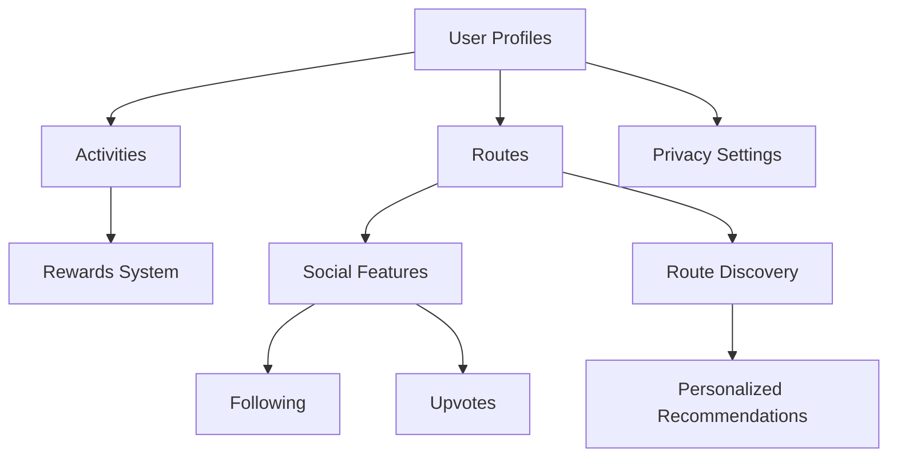

# StepNest Walking Tracker

A decentralized application for tracking, sharing, and discovering walking and hiking routes on the Stacks blockchain. Users can record activities, share routes, and earn rewards for consistent walking habits.

## Overview

StepNest creates a community-driven platform where walking enthusiasts can:
- Record and track walking activities
- Create and share walking routes
- Discover new routes through personalized recommendations
- Earn rewards for maintaining consistent walking habits
- Build social connections with other walkers

## Architecture

The StepNest platform is built on a single smart contract that manages all core functionality:



### Core Components
- User Management: Profiles, preferences, and activity tracking
- Route Management: Creation, sharing, and discovery of walking routes
- Activity Tracking: Recording walking sessions and maintaining streaks
- Social Features: Following other users and interacting with content
- Rewards System: Incentivizing consistent activity

## Contract Documentation

### Maps and Storage
- `users`: Stores user profiles and statistics
- `routes`: Contains walking route information
- `activities`: Records individual walking activities
- `follows`: Tracks social connections
- `favorites`: Stores user's favorite routes
- `upvotes`: Manages route ratings
- `user-preferences`: Stores personalized settings for route discovery

### Key Functions

#### User Management
```clarity
(define-public (register-user (username (string-utf8 50)) 
                            (bio (string-utf8 500)) 
                            (privacy-setting uint))
```
Creates or updates a user profile with basic information and privacy settings.

#### Route Management
```clarity
(define-public (create-route (name (string-utf8 100)) 
                           (description (string-utf8 500))
                           (distance uint)
                           ;; additional parameters...)
```
Creates a new walking route with detailed information including distance, elevation, and difficulty.

#### Activity Recording
```clarity
(define-public (record-activity (route-id (optional uint))
                              (distance uint)
                              (duration uint)
                              ;; additional parameters...)
```
Records a walking activity, updates user statistics, and processes rewards.

## Getting Started

### Prerequisites
- Clarinet
- Stacks wallet
- Node.js environment

### Installation
1. Clone the repository
2. Install dependencies
```bash
clarinet install
```
3. Run tests
```bash
clarinet test
```

## Function Reference

### User Functions
```clarity
;; Register new user
(contract-call? .stepnest register-user "username" "bio" u1)

;; Follow another user
(contract-call? .stepnest follow-user 'ST1PQHQKV0RJXZFY1DGX8MNSNYVE3VGZJSRTPGZGM)
```

### Route Functions
```clarity
;; Create new route
(contract-call? .stepnest create-route "Morning Walk" "Nice riverside path" u5000 ...)

;; Upvote a route
(contract-call? .stepnest upvote-route u1)
```

### Activity Functions
```clarity
;; Record walking activity
(contract-call? .stepnest record-activity none u5000 u100 u3600 ...)
```

## Development

### Testing
The contract includes comprehensive testing for all main functions. Run tests using:
```bash
clarinet test
```

### Local Development
1. Start Clarinet console:
```bash
clarinet console
```
2. Deploy contract:
```bash
(contract-call? .stepnest ...)
```

## Security Considerations

### Privacy
- Three levels of privacy settings: Public, Followers-only, and Private
- Users have full control over their data visibility
- Activity data can be restricted to specific audiences

### Access Control
- Function-level authorization checks
- Only route creators can modify their routes
- Only activity creators can modify their activities

### Limitations
- Route coordinates stored as strings (GeoJSON)
- Simplified reward mechanism
- Basic pagination implementation for route discovery

### Best Practices
- Verify privacy settings before accessing user data
- Check authorization before any modification operations
- Validate all input parameters
- Handle rate limiting in the front-end application